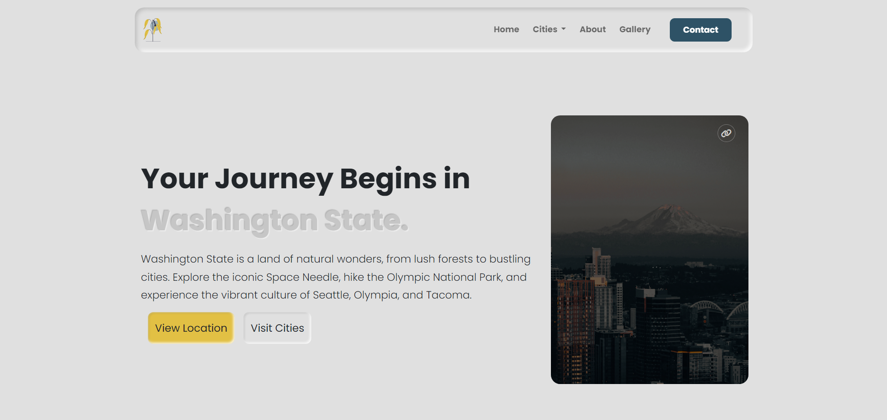

# (Website Name)



## Usage

This website is built with [Bootstrap](https://getbootstrap.com/) & [Sass](https://sass-lang.com/) & [javascript](https://www.javascript.com/). It uses [Font Awesome](https://fontawesome.com/) for icons.

In order to view this website, you need to install [Node.js](https://nodejs.org/en/). Then, clone this repository and run:

```bash
npm install
```

This will install Bootstrap, Sass and Font Awesome. To build your CSS files from Sass, run:

```bash
npm run sass:build
```

To watch your Sass files for changes, run:

```bash
npm run sass:watch
```

You can add Bootstrap variables to the `bootstrap.scss` file. You can look at the file `node_modules/bootstrap/dist/scss/_variables.scss` for a list of all the variables. Do NOT edit the `variables.scss` file directly, as it will be overwritten when you update Bootstrap.

To viw my own custom styles, use the `styles.scss` file or the "styles.css".
